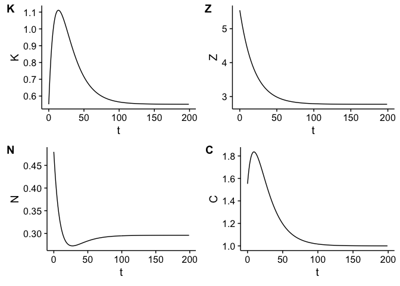

<!-- README.md is generated from README.Rmd. Please edit that file -->
lrem
====

The goal of lrem is to ...

Installation
------------

You can install lrem from github with:

``` r
# install.packages("devtools")
devtools::install_github("Akira55/lrem")
```

Example
-------

This is a basic example which shows you how to solve a common problem:

``` r
library("lrem")
#> 
#> Attaching package: 'lrem'
#> The following object is masked from 'package:stats':
#> 
#>     simulate
library("ggplot2")
library("cowplot")
#> 
#> Attaching package: 'cowplot'
#> The following object is masked from 'package:ggplot2':
#> 
#>     ggsave

# Extended E matrix
E_ <- matrix(c( -0.04384211, 0.06263158, 0.04384211, -1.05263158,
                 0.        ,  0.        , 0.        ,  0.        ,
                 1.        ,  0.        , 0.        ,  0.        ,
                 0.        ,  1.        , 0.        ,  0.        ),
             byrow = TRUE, nrow = 4)

# Extended A matrix
A_ <- matrix(c(0.        ,  0.        ,  0.        , -1.05263158,
               0.3       ,  1.        , -0.72012357, -1.       ,
               1.05263158,  0.20877193,  0.14614035, -0.19877193,
               0.        ,  0.95      ,  0.        ,  0.       ),
             byrow = TRUE, nrow = 4)

# Simulation length
steps <- 200

# Initial condition
x0 <- c(0, 1)

# Policy functions
policy <- lre_auto(A_, E_, nx = 2, x0 = x0)

# Simulation output
out <- simulate(policy$g, policy$h, x0, steps)
#> NULL
#> Shock vector has fewer components than state vector.

# Steady states
ss <- c(0.5511920622464518, 2.772987427012156, 0.29583592293349903, 1)

# Convert percentage changes to levels
for (i in 1:ncol(out)) {
  out[, i] <- ss[i] * out[, i] + ss[i]
}

# Convert matrix to dataframe
result <- data.frame(out)
names(result) <- c("K", "Z", "N", "C")
result["t"] <- 0:(steps - 1)

# Plotting
plot.k <- ggplot(result) + geom_line(aes(x = t, y = K))
plot.z <- ggplot(result) + geom_line(aes(x = t, y = Z))
plot.n <- ggplot(result) + geom_line(aes(x = t, y = N))
plot.c <- ggplot(result) + geom_line(aes(x = t, y = C))

plot_grid(plot.k, plot.z, plot.n, plot.c, 
          labels = c("K", "Z", "N", "C"), ncol = 2)
```


